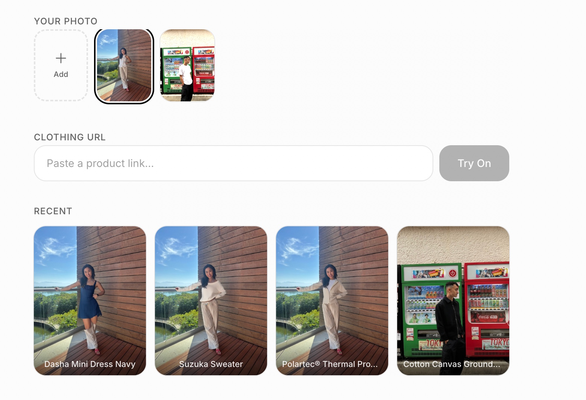

# Natasha — Virtual Try-On

Upload a photo of yourself, paste a clothing URL, and instantly see how it looks on you.



## Problem Statement

Online shopping for clothes is a gamble. You find something you love, but you have no idea how it'll actually look on your body. Size charts are inconsistent across brands, model photos don't represent most body types, and returns are a hassle. As a result, people either avoid buying clothes they'd love, or end up with a pile of returns and wasted money.

Virtual try-on technology exists, but it's locked behind enterprise solutions built for retailers, not consumers. There's no simple tool where you can just upload your photo, paste a link, and see the result.

## Target Users

Anyone who shops for clothes online and wants to:
- See how a garment actually looks on their body before buying
- Reduce returns by making more confident purchase decisions
- Build a visual wardrobe of tried-on looks for reference

## Features

- **Instant virtual try-on**: Upload a photo of yourself, paste a clothing product URL, and get an AI-generated image of you wearing that item
- **Universal product scraping**: The app automatically extracts the product name and image from the page
- **Photo bank**: Save multiple photos of yourself and switch between them for different try-ons
- **Try-on history**: All results are saved so you can revisit and compare past try-ons
- **Mobile-first design**: Built for phones with touch-friendly interactions like long-press to delete

## Key Product Decisions

| Decision | Rationale |
|---|---|
| One image per try-on (descoped per-size from MVP) | The original plan was to show clothing in different sizes on the user's body. This required user body measurements, scraping size charts (which vary wildly by retailer), and an AI model that understands dimensions — fashn.ai doesn't. Each problem was solvable alone, but all three together pushed scope well beyond MVP. Shipped with one high-quality try-on per garment instead — one API call, fast and cheap. |
| Stealth browser scraping over retailer APIs | No retailer integrations needed. Playwright with stealth mode works across any website, making the app instantly compatible with every clothing store. |
| Single-page app | The entire flow — photo selection, URL input, result display, history — fits naturally on one screen. No routing complexity, no navigation friction. |
| No authentication | Removes the biggest barrier to trying the app. A single default user keeps the experience instant — open the app and go. |
| Web app over native mobile | No app store approval, no downloads, accessible from any device. Lower barrier to entry for a utility tool. |

## Product Vision & Roadmap

### Near-term
- **Size-aware fit commentary**: Combine the visual try-on with text-based fit analysis by comparing user body measurements against scraped garment measurements (e.g. "Size S: likely tight in chest, sleeves may be short")
- **User measurements profile**: Input your height, chest, waist, and hip measurements once, and get personalised fit guidance on every try-on
- **Side-by-side comparison**: View two try-on results next to each other to compare different garments or sizes

### Medium-term
- **Browser extension**: Try on clothes directly from product pages without leaving the retailer's site
- **Outfit builder**: Combine multiple garments (top + bottom + accessories) into a single try-on
- **Wishlist integration**: Save items you've tried on to a wishlist with direct purchase links

### Long-term
- **Multi-user support with authentication**: Personal accounts so multiple people can use the same instance
- **Social sharing**: Share try-on results with friends for opinions before purchasing
- **Retailer partnerships**: Embed virtual try-on directly into online stores as a white-label feature

## Success Metrics

| Metric | What it measures |
|---|---|
| Try-ons per user | Engagement depth: are users trying on multiple items? |
| Return visits | Retention: do users come back when shopping for new clothes? |
| Scrape success rate | Reliability: how often does the app successfully extract product images from URLs? |
| Try-on generation time | Experience quality: how long do users wait for results? |
| Photos uploaded per user | Investment: are users building a personal photo bank? |

## Competitive Landscape

Most virtual try-on solutions are B2B — built for retailers to embed in their own stores (e.g. Zeekit/Walmart, Google's virtual try-on). Consumers can only use them on specific retailer sites that have integrated the technology. Natasha flips this by being a consumer-first tool that works with any clothing URL. No retailer integration required — just paste a link and see the result on your own photo.

## Setup

1. Clone the repo
2. Install dependencies: `pnpm install`
3. Install Playwright browser (needed for product scraping): `npx playwright install chromium`
4. Set up the database: `npx prisma db push`
5. Create a `.env.local` file:
   ```
   FASHN_API_KEY=your-fashn-api-key
   ```
   Get an API key at [fashn.ai](https://fashn.ai).
6. Run the dev server: `pnpm dev`
7. Open http://localhost:3000

## Tech Stack

- Next.js 16 (App Router) + TypeScript
- Prisma + SQLite
- Tailwind CSS (custom design, no component library)
- [fashn.ai](https://fashn.ai) (tryon-v1.6) for virtual try-on
- Playwright (stealth browser) for product scraping
- sharp for image processing
